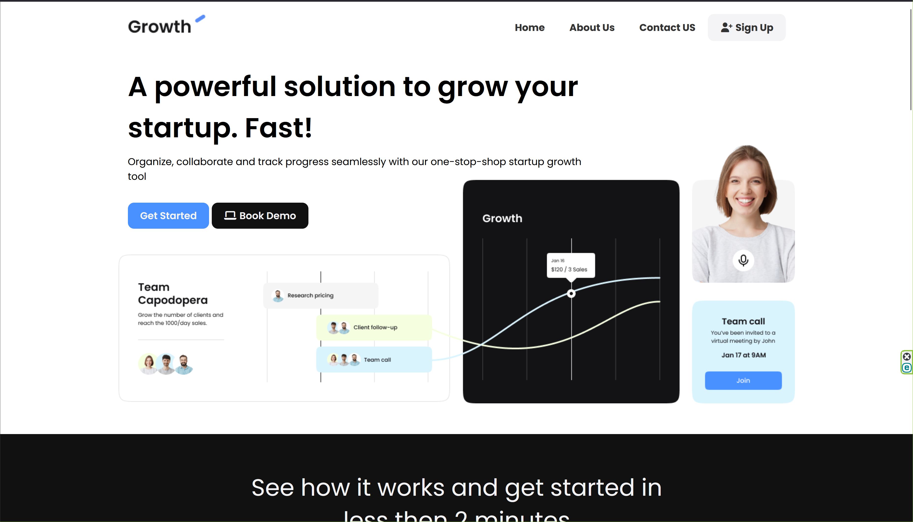

# Website Project

A simple, responsive website built with HTML and CSS.



## Description

This project is a static website showcasing modern web design principles using pure HTML and CSS. It features a clean, responsive layout that works across different screen sizes and devices.

## Features

- Responsive design that adapts to mobile, tablet, and desktop screens
- Clean and modern user interface
- Semantic HTML5 markup
- CSS3 styling with modern layout techniques
- Cross-browser compatible

## Technologies Used

- HTML5
- CSS3

## Getting Started

### Prerequisites

You only need a web browser to run this website. No additional software or dependencies are required.

### Installation

1. Clone or download this repository to your local machine
2. Navigate to the project folder
3. Open `index.html` in your web browser

Alternatively, you can simply double-click the `index.html` file to open it in your default browser.

## Project Structure

```
project-folder/
│
├── index.html
├── css/
│   └── style.css
├── images/
├── js/
|   └── main.js
└── README.md
```

## Usage

Simply open the website in any modern web browser. Navigate through the pages using the navigation menu or links provided.

## Customization

To customize this website:

1. Edit `index.html` to change the content and structure
2. Modify `css/style.css` to update colors, fonts, layouts, and other styling
3. Add your own images to the `images/` folder and reference them in the HTML

## Browser Support

This website is compatible with:

- Chrome (latest)
- Firefox (latest)
- Safari (latest)
- Edge (latest)

## License

This project is open source and available under the [MIT License](LICENSE).

## Contact

For questions or feedback, please contact [kamran.khan@student.lut.fi]
